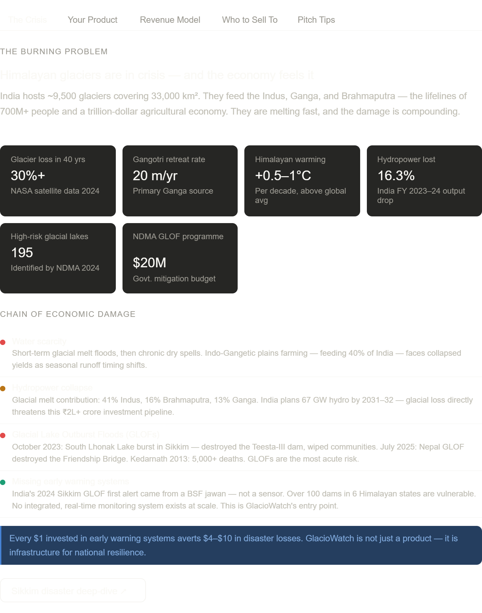
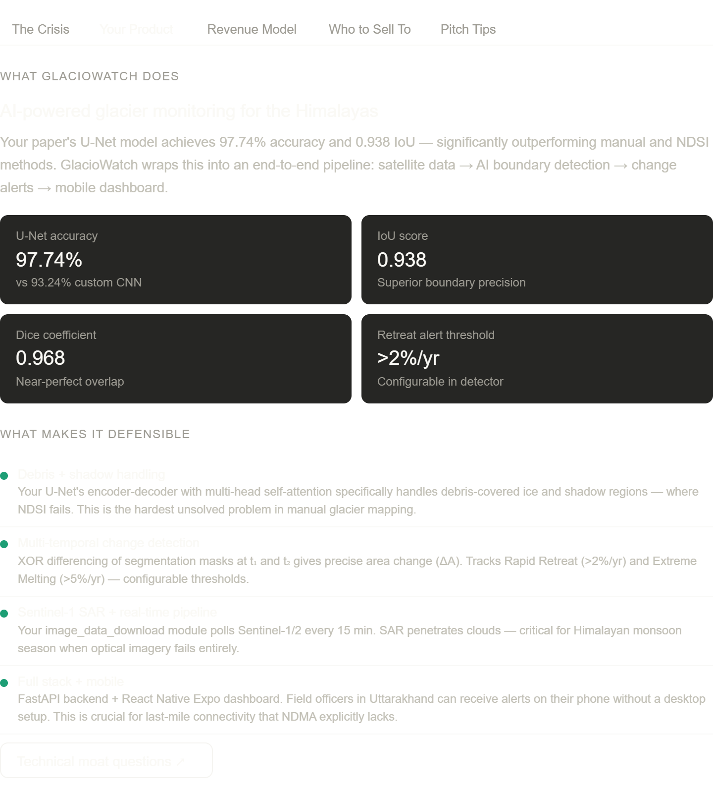
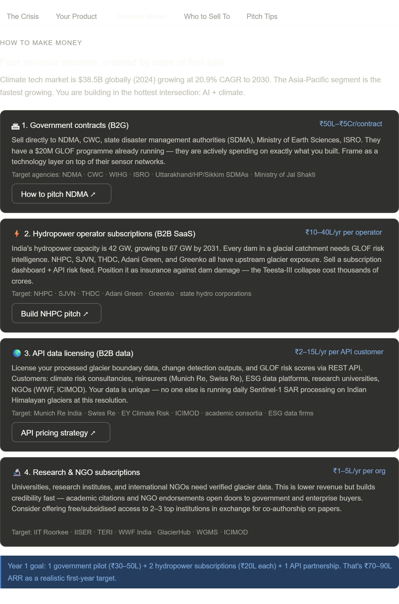
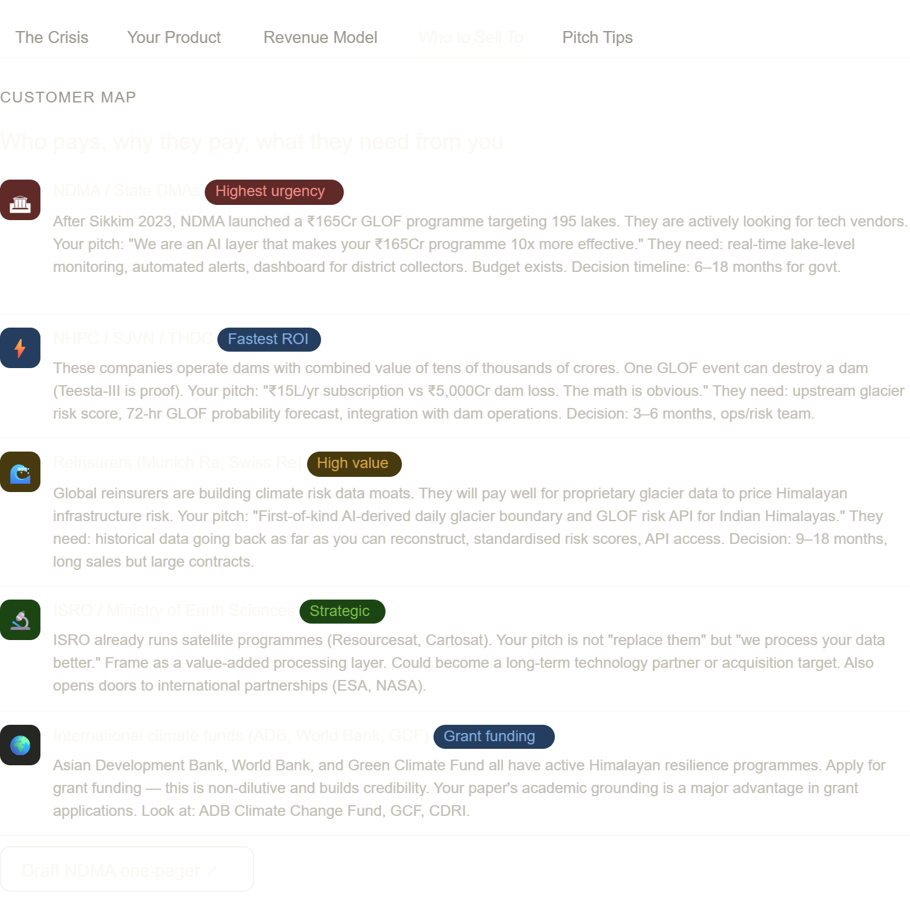
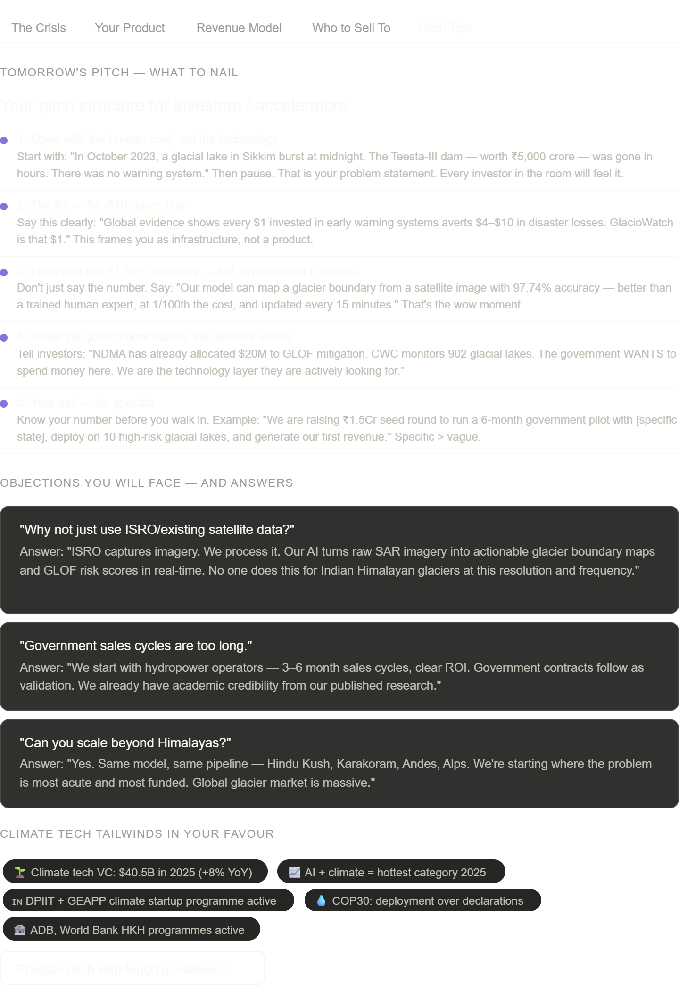

Now I have everything I need. Let me build a comprehensive report and pitch strategy.Now I'll create the comprehensive report and pitch deck widget.Here's your full briefing for tomorrow. Let me walk you through the key takeaways from each tab:

**The Crisis (Tab 1)** — The Himalayan glacier situation is genuinely alarming and well-documented. Glacier-covered areas in the Himalayas have decreased by over 30% in the last four decades, and the Gangotri Glacier is shrinking at 20 meters per year. Critically, India saw a 16.3% decline in hydroelectric power output in FY 2023–24 due to irregular rainfall and natural disasters, and the absence of early warning systems and disaster-resilient infrastructure leads to significant human and economic losses — the 2023 Sikkim GLOF is a stark example.

**The Market Opportunity** — India's NDMA has backed a $20 million risk mitigation programme targeting 189–195 high-risk glacial lakes, combining early warning systems, hazard mapping, structural measures, and community awareness. Government money is already flowing — GlacioWatch can be the technology layer.

**Revenue Model (Tab 3)** — Your clearest path to first revenue is hydropower operators (NHPC, SJVN, THDC), then government pilots, then API licensing to reinsurers. The pitch to hydro companies is simple: ₹15L/yr subscription vs a ₹5,000Cr dam loss.

**Investor Tailwinds (Tab 5)** — Climate tech venture and growth investment totalled $40.5 billion in 2025, up 8% from 2024, and the Asia Pacific climate tech market is expected to grow at the fastest CAGR from 2025 to 2030. You're pitching at the best possible moment.

The interactive buttons in each tab will let you go deeper on any section — especially the "Practice pitch with tough questions" button in the Pitch Tips tab, which you can use tonight to prepare.